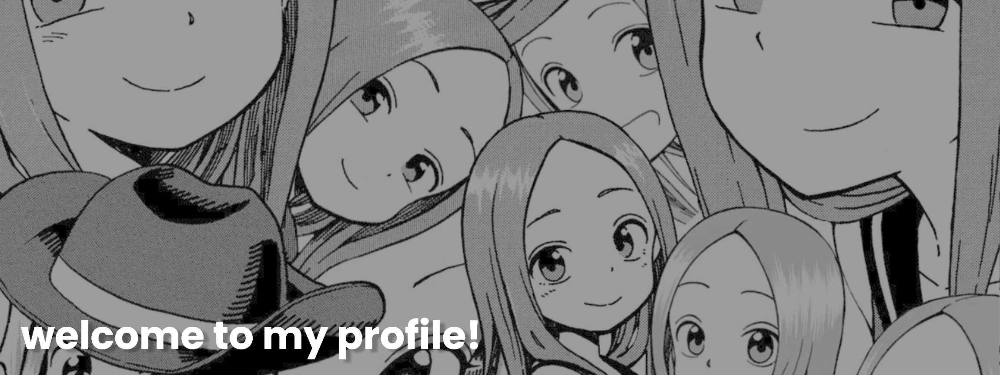

<h1 align="center" style="display: block; font-size: 2.5em; font-weight: bold; margin-block-start: 1em; margin-block-end: 1em;"> Pleasure to meet you! </h1>

### A little bit about me
Hi, my name is Felipe Redivo Fragoso, 17 years old and currently in high school. Right now I use GitHub only for school projects, but when I start working on some other projects, I'll surely put it here. Ah, and I'm also brazilian.

### Personal tastes
I'm really into music, anime, manga and games. I also like to code, although I get really stressed when something goes wrong with the code (everytime). But the satisfaction after resolving a problem with the code makes it worth it. Going further into my doubtful tastes, I love japanese songs, mostly Vocaloid. My favorite anime is Teasing Master Takagi-san and my favorite game is Red Dead Redemption 2.

&nbsp;

